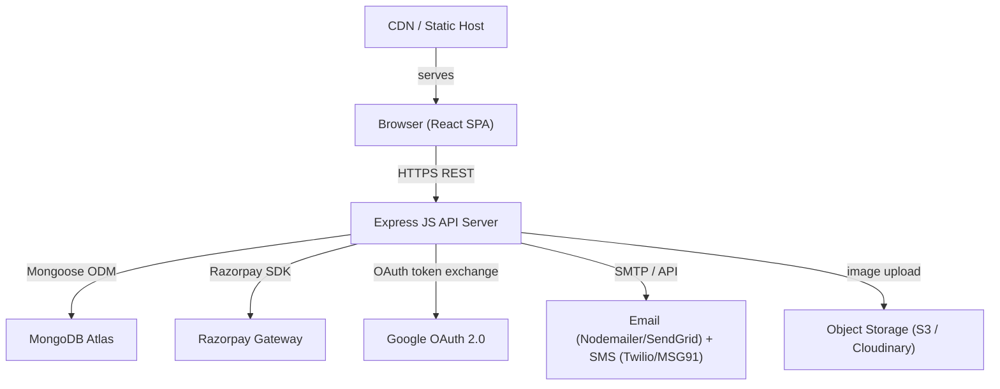
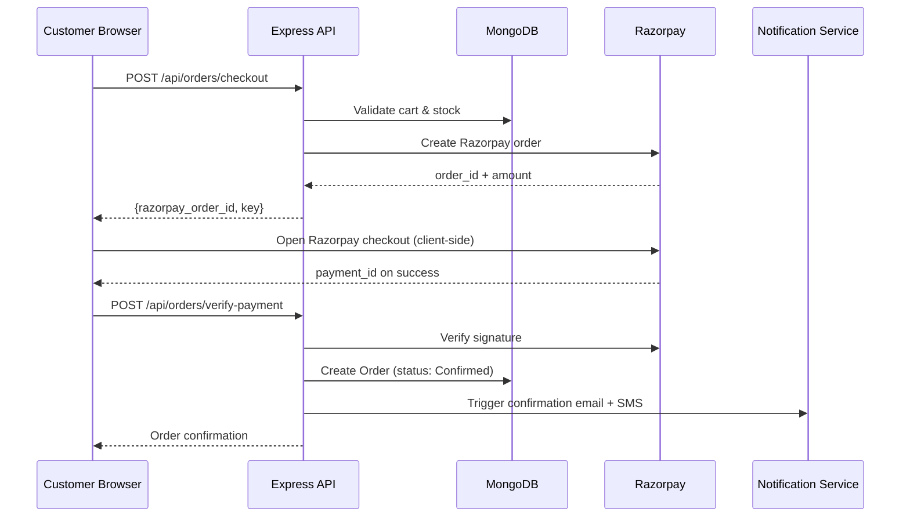

# Design Document: Muzab Ecommerce Platform

## Overview

Muzab is a full-stack ecommerce platform for a saffron and natural products brand based in Srinagar, J&K, India. The platform sells premium Kashmiri saffron, natural oils, skincare, and spices, and targets Indian customers with India-specific payment methods, GST handling, and PIN-code-based delivery eligibility.

The system is a classic three-tier web application:
- **Frontend**: React JS SPA served via a CDN or static host
- **Backend**: Express JS REST API
- **Database**: MongoDB (document model suits flexible product variants and order data)
- **Payments**: Razorpay (UPI, cards, net banking, wallets, COD)
- **Auth**: JWT (stateless sessions) + Google OAuth 2.0

Brand palette applied throughout the UI:
| Token | Hex | Usage |
|---|---|---|
| Saffron Red | `#C0392B` | Primary actions, CTAs |
| Gold | `#D4A017` | Highlights, badges, ratings |
| Indigo | `#3B1F6E` | Headers, navigation |
| Natural Linen | `#F5F0E8` | Page backgrounds |
| Warm Slate | `#6B7280` | Secondary text |

---

## Architecture

### High-Level Architecture



### Request Flow



### Deployment Topology

```
┌─────────────────────────────────────────────────────┐
│  Vercel / Netlify (React SPA + CDN)                 │
└──────────────────────┬──────────────────────────────┘
                       │ HTTPS
┌──────────────────────▼──────────────────────────────┐
│  Railway / Render / EC2 (Express API)               │
│  - /api/*  routes                                   │
│  - JWT middleware                                   │
│  - Razorpay webhook endpoint                        │
└──────────────────────┬──────────────────────────────┘
                       │ Mongoose
┌──────────────────────▼──────────────────────────────┐
│  MongoDB Atlas (M10+ cluster)                       │
│  - products, users, orders, carts, reviews          │
└─────────────────────────────────────────────────────┘
```

---

## Components and Interfaces

### Frontend Components

```
src/
├── components/
│   ├── layout/         Header, Footer, Navbar, MobileMenu
│   ├── product/        ProductCard, ProductGallery, VariantSelector, ReviewList, ReviewForm, StarRating
│   ├── cart/           CartDrawer, CartItem, CartSummary
│   ├── checkout/       AddressForm, OrderReview, PaymentStep, CheckoutStepper
│   ├── auth/           LoginForm, RegisterForm, GoogleLoginButton, PasswordResetForm
│   ├── order/          OrderList, OrderDetail, OrderStatusBadge
│   └── admin/          Dashboard, ProductForm, OrderTable, CustomerTable, LowStockAlert
├── pages/
│   ├── Home, Catalog, ProductDetail, Cart, Checkout
│   ├── Login, Register, ForgotPassword, ResetPassword
│   ├── MyOrders, OrderDetail
│   └── admin/ (Dashboard, Products, Orders, Customers)
├── hooks/              useCart, useAuth, useOrders, useProducts
├── context/            AuthContext, CartContext
├── services/           api.js (Axios instance), razorpay.js
└── utils/              validators, formatCurrency, pinCodeCheck
```

### Backend Services (Express Routers)

| Router | Prefix | Responsibility |
|---|---|---|
| Auth Router | `/api/auth` | Register, login, logout, Google OAuth, password reset |
| Product Router | `/api/products` | CRUD products, variants, search, filter |
| Cart Router | `/api/cart` | Add/update/remove items, get cart |
| Order Router | `/api/orders` | Checkout, verify payment, list/detail, cancel |
| Review Router | `/api/reviews` | Submit, list, admin approve/remove |
| Admin Router | `/api/admin` | Dashboard metrics, order management, customer export |
| Webhook Router | `/api/webhooks` | Razorpay payment events |

### Key Middleware

- `authMiddleware` — verifies JWT, attaches `req.user`
- `adminMiddleware` — checks `req.user.role === 'admin'`
- `rateLimiter` — express-rate-limit on auth endpoints
- `errorHandler` — centralised error response formatter

---

## Data Models

### User

```js
{
  _id: ObjectId,
  name: String,                  // required
  email: String,                 // unique, required
  passwordHash: String,          // bcrypt, null for OAuth-only users
  phone: String,
  role: { type: String, enum: ['customer', 'admin'], default: 'customer' },
  googleId: String,              // OAuth sub
  isEmailVerified: Boolean,
  emailVerificationToken: String,
  passwordResetToken: String,
  passwordResetExpiry: Date,
  addresses: [{
    label: String,               // "Home", "Work"
    line1: String,
    line2: String,
    city: String,
    state: String,
    pinCode: String,
    phone: String,
    isDefault: Boolean
  }],
  createdAt: Date,
  updatedAt: Date
}
```

### Product

```js
{
  _id: ObjectId,
  name: String,                  // required
  slug: String,                  // unique, URL-friendly
  category: String,              // e.g. "Saffron", "Oils", "Skincare"
  description: String,
  ingredients: String,
  images: [String],              // URLs (Cloudinary / S3)
  basePrice: Number,
  variants: [{
    label: String,               // e.g. "1g", "5g", "10ml"
    price: Number,
    stock: Number,
    sku: String
  }],
  stock: Number,                 // total / default stock (no variants)
  isActive: Boolean,
  averageRating: Number,
  reviewCount: Number,
  lowStockThreshold: { type: Number, default: 5 },
  tags: [String],
  createdAt: Date,
  updatedAt: Date
}
```

### Cart

```js
{
  _id: ObjectId,
  userId: ObjectId,              // null for guest (session-based)
  sessionId: String,             // for guest carts
  items: [{
    productId: ObjectId,
    variantLabel: String,
    quantity: Number,
    unitPrice: Number,           // snapshot at time of add
    name: String,                // snapshot
    image: String                // snapshot
  }],
  updatedAt: Date
}
```

### Order

```js
{
  _id: ObjectId,
  orderId: String,               // human-readable: MZB-YYYYMMDD-XXXX
  userId: ObjectId,              // null for guest
  guestEmail: String,
  items: [{
    productId: ObjectId,
    variantLabel: String,
    name: String,
    image: String,
    quantity: Number,
    unitPrice: Number,
    lineTotal: Number
  }],
  deliveryAddress: {
    name: String,
    line1: String,
    line2: String,
    city: String,
    state: String,
    pinCode: String,
    phone: String
  },
  subtotal: Number,
  shippingFee: Number,
  gst: Number,
  grandTotal: Number,
  paymentMethod: { type: String, enum: ['razorpay', 'cod'] },
  paymentStatus: { type: String, enum: ['pending', 'paid', 'failed', 'refunded'] },
  razorpayOrderId: String,
  razorpayPaymentId: String,
  razorpaySignature: String,
  status: {
    type: String,
    enum: ['Confirmed', 'Processing', 'Shipped', 'Delivered', 'Cancelled', 'Refunded'],
    default: 'Confirmed'
  },
  statusHistory: [{
    status: String,
    changedAt: Date,
    note: String
  }],
  createdAt: Date,
  updatedAt: Date
}
```

### Review

```js
{
  _id: ObjectId,
  productId: ObjectId,
  userId: ObjectId,
  orderId: ObjectId,             // verified purchase reference
  rating: { type: Number, min: 1, max: 5 },
  text: String,
  isApproved: { type: Boolean, default: false },
  createdAt: Date
}
```

### PinCode (Serviceability)

```js
{
  _id: ObjectId,
  pinCode: String,               // unique
  city: String,
  state: String,
  isServiceable: Boolean,
  codEligible: Boolean,
  shippingFee: Number
}
```

---

## API Design

### Auth Endpoints

| Method | Path | Auth | Description |
|---|---|---|---|
| POST | `/api/auth/register` | — | Register new customer |
| POST | `/api/auth/login` | — | Email/password login → JWT |
| POST | `/api/auth/logout` | JWT | Invalidate token (token blacklist) |
| GET | `/api/auth/google` | — | Initiate Google OAuth |
| GET | `/api/auth/google/callback` | — | OAuth callback |
| POST | `/api/auth/forgot-password` | — | Send reset link |
| POST | `/api/auth/reset-password/:token` | — | Set new password |
| GET | `/api/auth/verify-email/:token` | — | Verify email |

### Product Endpoints

| Method | Path | Auth | Description |
|---|---|---|---|
| GET | `/api/products` | — | List products (filter, search, paginate) |
| GET | `/api/products/:slug` | — | Product detail |
| POST | `/api/products` | Admin | Create product |
| PUT | `/api/products/:id` | Admin | Update product |
| DELETE | `/api/products/:id` | Admin | Soft-delete product |

### Cart Endpoints

| Method | Path | Auth | Description |
|---|---|---|---|
| GET | `/api/cart` | JWT/session | Get cart |
| POST | `/api/cart/items` | JWT/session | Add item |
| PUT | `/api/cart/items/:itemId` | JWT/session | Update quantity |
| DELETE | `/api/cart/items/:itemId` | JWT/session | Remove item |

### Order Endpoints

| Method | Path | Auth | Description |
|---|---|---|---|
| POST | `/api/orders/checkout` | JWT/guest | Create Razorpay order + validate cart |
| POST | `/api/orders/verify-payment` | JWT/guest | Verify Razorpay signature → confirm order |
| GET | `/api/orders` | JWT | Customer order list |
| GET | `/api/orders/:id` | JWT | Order detail |
| POST | `/api/orders/:id/cancel` | JWT | Cancel order |

### Admin Endpoints

| Method | Path | Auth | Description |
|---|---|---|---|
| GET | `/api/admin/dashboard` | Admin | Summary metrics |
| GET | `/api/admin/orders` | Admin | Filter/search orders |
| PUT | `/api/admin/orders/:id/status` | Admin | Update order status |
| POST | `/api/admin/orders/:id/refund` | Admin | Initiate refund |
| GET | `/api/admin/customers` | Admin | Customer list |
| GET | `/api/admin/customers/export` | Admin | CSV export |

### Webhook

| Method | Path | Auth | Description |
|---|---|---|---|
| POST | `/api/webhooks/razorpay` | HMAC sig | Handle Razorpay events |


---

## Correctness Properties

*A property is a characteristic or behavior that should hold true across all valid executions of a system — essentially, a formal statement about what the system should do. Properties serve as the bridge between human-readable specifications and machine-verifiable correctness guarantees.*

### Property 1: Catalog completeness

*For any* set of active products in the database, a GET request to the catalog endpoint should return all of them, each containing at minimum: name, image URL, price, and short description. No inactive product should appear.

**Validates: Requirements 1.2**

---

### Property 2: Category filter exclusivity

*For any* category value used as a filter, every product returned by the search service should belong to that category, and no product from a different category should be included.

**Validates: Requirements 1.3**

---

### Property 3: Search result relevance

*For any* non-empty search query string, every product returned by the search service should have the query string present (case-insensitive) in its name or description. Products with no match should not appear.

**Validates: Requirements 1.4**

---

### Property 4: Product detail field completeness

*For any* active product, the product detail endpoint should return all required fields: name, images array, description, ingredients, price, stock availability, and variant list (if applicable).

**Validates: Requirements 1.5, 1.7**

---

### Property 5: Out-of-stock invariant

*For any* product or variant with stock quantity equal to zero, the API response should include `inStock: false`. For any product or variant with stock > 0, `inStock` should be `true`.

**Validates: Requirements 1.6**

---

### Property 6: Average rating correctness

*For any* product with one or more approved reviews, the `averageRating` field on the product should equal the arithmetic mean of all approved review ratings, rounded to one decimal place.

**Validates: Requirements 1.8, 9.3**

---

### Property 7: Cart addition round-trip

*For any* active product and valid variant, adding it to a cart and then retrieving the cart should result in the cart containing an item with the correct productId, variantLabel, quantity, and unitPrice snapshot.

**Validates: Requirements 2.1, 2.2**

---

### Property 8: Cart total calculation invariant

*For any* cart state, the following must hold: `lineTotal = unitPrice × quantity` for each item, `subtotal = Σ lineTotals`, and `grandTotal = subtotal + shippingFee + GST`. These invariants must hold after every add, update, or remove operation.

**Validates: Requirements 2.3, 2.4, 2.7, 4.5**

---

### Property 9: Cart persistence across sessions

*For any* authenticated customer who adds items to their cart, retrieving the cart in a new session (new JWT, same userId) should return the same items with the same quantities.

**Validates: Requirements 2.5**

---

### Property 10: Password policy enforcement

*For any* registration or password-reset payload where the password is fewer than 8 characters, or lacks at least one uppercase letter, one lowercase letter, or one digit, the Auth_Service should reject the request with a validation error. For any password satisfying all constraints, the request should proceed.

**Validates: Requirements 3.7**

---

### Property 11: Login error message uniformity

*For any* login attempt with an unrecognised email and *for any* login attempt with a recognised email but wrong password, the error response body and HTTP status code should be identical, revealing no information about which field was incorrect.

**Validates: Requirements 3.3**

---

### Property 12: JWT expiry correctness

*For any* successful login, the issued JWT's `exp` claim should be within a 60-second window of `iat + 7 days`.

**Validates: Requirements 3.2**

---

### Property 13: Password reset token expiry

*For any* password reset token stored in the database, its `passwordResetExpiry` field should be within a 60-second window of `createdAt + 1 hour`. Any request using a token past its expiry should be rejected.

**Validates: Requirements 3.4, 3.6**

---

### Property 14: Token invalidation after logout

*For any* JWT that was valid before a logout call, using that same token on any authenticated endpoint after logout should return HTTP 401.

**Validates: Requirements 3.8**

---

### Property 15: Address validation completeness

*For any* checkout address payload missing any required field (name, line1, city, state, pinCode, phone) or containing a malformed PIN code (not 6 digits), the checkout endpoint should return a validation error. For any complete, correctly formatted address, validation should pass.

**Validates: Requirements 4.3**

---

### Property 16: PIN code serviceability gate

*For any* PIN code not present in the serviceability collection (or marked `isServiceable: false`), the checkout endpoint should reject the order with a delivery-unavailable error. For any serviceable PIN code, checkout should proceed.

**Validates: Requirements 4.4**

---

### Property 17: COD eligibility gate

*For any* checkout using COD as the payment method, the order should only be accepted if the delivery PIN code has `codEligible: true`. For non-eligible PIN codes, COD should be rejected.

**Validates: Requirements 4.8**

---

### Property 18: Order creation on payment confirmation

*For any* valid Razorpay payment verification (correct signature), the Order_Service should create an order record with `status: "Confirmed"` and `paymentStatus: "paid"`, and the `razorpayPaymentId` should be stored on the order.

**Validates: Requirements 4.6, 5.3**

---

### Property 19: No raw card data in order records

*For any* order document in the database, it should not contain any field matching patterns for card numbers (16-digit sequences) or CVV values (3–4 digit security codes).

**Validates: Requirements 5.5**

---

### Property 20: Refund status transition

*For any* order with `paymentStatus: "paid"`, when an admin initiates a refund, the order's `status` should transition to `"Refunded"` and `paymentStatus` to `"refunded"`.

**Validates: Requirements 5.6, 7.8**

---

### Property 21: Order list isolation

*For any* authenticated customer, the `/api/orders` endpoint should return only orders belonging to that customer's userId. Orders belonging to other customers should never appear.

**Validates: Requirements 6.1**

---

### Property 22: Cancellation state machine

*For any* order with status `"Confirmed"` or `"Processing"`, a cancellation request should succeed and transition the order to `"Cancelled"`. For any order with status `"Shipped"`, `"Delivered"`, or `"Refunded"`, a cancellation request should be rejected with an appropriate error.

**Validates: Requirements 6.4, 6.5**

---

### Property 23: Order event notifications

*For any* order status change (by admin or system), the Notification_Service's send function should be called exactly once with the customer's email and the new status. This applies to: order confirmation, status updates, and cancellations.

**Validates: Requirements 6.3, 7.5, 10.1, 10.2**

---

### Property 24: Admin role enforcement

*For any* request to an `/api/admin/*` endpoint using a JWT belonging to a customer-role user, the response should be HTTP 403. For any request using an admin-role JWT, the endpoint should be accessible.

**Validates: Requirements 7.1**

---

### Property 25: Product creation validation

*For any* admin product creation payload missing any required field (name, category, description, price, stock, images), the endpoint should return a validation error and no product should be created in the database.

**Validates: Requirements 7.3**

---

### Property 26: Product update reflected in catalog

*For any* admin update to a product's price or stock, a subsequent GET to the product detail or catalog endpoint should return the updated values.

**Validates: Requirements 7.4**

---

### Property 27: Order filter correctness

*For any* combination of admin order filters (status, date range, customer email), every order returned should satisfy all applied filter criteria, and no order failing any criterion should appear.

**Validates: Requirements 7.6**

---

### Property 28: Low-stock alert threshold

*For any* product with `stock < lowStockThreshold`, it should appear in the admin low-stock list. For any product with `stock >= lowStockThreshold`, it should not appear. When stock drops below the threshold, the Notification_Service should be called with an admin alert.

**Validates: Requirements 7.9, 10.3**

---

### Property 29: Verified-buyer review gate

*For any* review submission where the submitting user has no completed order containing the target product, the submission should be rejected. For any user with a confirmed order containing the product, submission should succeed.

**Validates: Requirements 9.1, 9.2**

---

### Property 30: Review visibility gate

*For any* product detail response on the public API, only reviews with `isApproved: true` should be included. Reviews with `isApproved: false` should never appear in public responses.

**Validates: Requirements 9.4**

---

### Property 31: Registration notification

*For any* successful customer registration, the Notification_Service's welcome-email function should be called exactly once with the new customer's email address.

**Validates: Requirements 3.1, 10.4**

---

## Error Handling

### Strategy

All errors are returned as JSON with a consistent envelope:

```json
{
  "success": false,
  "error": {
    "code": "VALIDATION_ERROR",
    "message": "Human-readable message",
    "details": []
  }
}
```

### Error Codes

| Code | HTTP Status | Scenario |
|---|---|---|
| `VALIDATION_ERROR` | 400 | Missing/malformed request fields |
| `UNAUTHORIZED` | 401 | Missing or invalid JWT |
| `FORBIDDEN` | 403 | Insufficient role |
| `NOT_FOUND` | 404 | Resource does not exist |
| `CONFLICT` | 409 | Duplicate email on registration |
| `UNSERVICEABLE_PIN` | 422 | PIN code outside delivery area |
| `OUT_OF_STOCK` | 422 | Product/variant unavailable at checkout |
| `PAYMENT_FAILED` | 422 | Razorpay payment failure |
| `PAYMENT_PENDING` | 202 | Razorpay timeout/network error |
| `CANCELLATION_DENIED` | 422 | Order already shipped |
| `INTERNAL_ERROR` | 500 | Unexpected server error |

### Critical Error Flows

**Payment timeout**: Order is created with `status: "Confirmed"` and `paymentStatus: "pending"`. A Razorpay webhook (`payment.captured` or `payment.failed`) reconciles the final state. Admin is notified via email.

**Stock race condition at checkout**: Stock is decremented atomically using MongoDB's `findOneAndUpdate` with `$inc: { stock: -qty }` and a `stock >= qty` filter. If the filter fails to match, checkout returns `OUT_OF_STOCK`.

**JWT token blacklist**: On logout, the JWT `jti` (JWT ID) is stored in a Redis set (or MongoDB collection) with TTL equal to the token's remaining lifetime. The `authMiddleware` checks this blacklist on every request.

**Google OAuth failure**: If the OAuth callback returns an error, the user is redirected to `/login?error=oauth_failed` with a user-friendly message.

---

## Testing Strategy

### Dual Testing Approach

Both unit/integration tests and property-based tests are required. They are complementary:
- Unit/integration tests catch concrete bugs with specific inputs and verify integration points.
- Property-based tests verify universal correctness across the full input space.

### Unit and Integration Tests

Focus areas:
- Auth flows: registration, login, logout, password reset, Google OAuth (mocked)
- Cart operations: add, update, remove, subtotal calculation
- Checkout: address validation, PIN serviceability, COD eligibility
- Order state machine: valid and invalid status transitions
- Admin role enforcement: 403 on customer tokens, 200 on admin tokens
- Razorpay signature verification logic
- Notification service: verify send functions are called with correct arguments (mock transport)

### Property-Based Testing

**Library**: [fast-check](https://github.com/dubzzz/fast-check) (JavaScript/TypeScript, works with Jest/Vitest)

**Configuration**: Each property test must run a minimum of **100 iterations**.

**Tag format** for each test:
```
// Feature: muzab-ecommerce, Property {N}: {property_text}
```

**Property test mapping**:

| Property | Test Description | Arbitraries |
|---|---|---|
| P1 | Catalog completeness | `fc.array(productArb)` |
| P2 | Category filter exclusivity | `fc.string(), fc.array(productArb)` |
| P3 | Search result relevance | `fc.string(), fc.array(productArb)` |
| P4 | Product detail field completeness | `productArb` |
| P5 | Out-of-stock invariant | `fc.integer({ min: 0, max: 1000 })` |
| P6 | Average rating correctness | `fc.array(fc.integer({ min: 1, max: 5 }), { minLength: 1 })` |
| P7 | Cart addition round-trip | `productArb, variantArb` |
| P8 | Cart total calculation invariant | `fc.array(cartItemArb, { minLength: 1 })` |
| P9 | Cart persistence across sessions | `userArb, fc.array(cartItemArb)` |
| P10 | Password policy enforcement | `fc.string()` (invalid passwords) |
| P11 | Login error message uniformity | `emailArb, passwordArb` |
| P12 | JWT expiry correctness | `userArb` |
| P13 | Password reset token expiry | `userArb` |
| P14 | Token invalidation after logout | `userArb` |
| P15 | Address validation completeness | `addressArb` (partial/complete) |
| P16 | PIN code serviceability gate | `fc.string()` (random PIN codes) |
| P17 | COD eligibility gate | `pinCodeArb` |
| P18 | Order creation on payment confirmation | `orderArb, razorpayPayloadArb` |
| P19 | No raw card data in order records | `orderArb` |
| P20 | Refund status transition | `paidOrderArb` |
| P21 | Order list isolation | `fc.array(userArb), fc.array(orderArb)` |
| P22 | Cancellation state machine | `orderArb` (all statuses) |
| P23 | Order event notifications | `orderArb, statusArb` |
| P24 | Admin role enforcement | `userArb` (customer + admin roles) |
| P25 | Product creation validation | `partialProductArb` |
| P26 | Product update reflected in catalog | `productArb, updateArb` |
| P27 | Order filter correctness | `fc.array(orderArb), filterArb` |
| P28 | Low-stock alert threshold | `fc.integer({ min: 0 }), fc.integer({ min: 1 })` |
| P29 | Verified-buyer review gate | `userArb, productArb, orderArb` |
| P30 | Review visibility gate | `fc.array(reviewArb)` |
| P31 | Registration notification | `registrationPayloadArb` |

### Example Property Test (fast-check)

```js
// Feature: muzab-ecommerce, Property 8: Cart total calculation invariant
test('cart totals are always consistent', () => {
  fc.assert(
    fc.property(fc.array(cartItemArb, { minLength: 1 }), (items) => {
      const cart = buildCart(items);
      const expectedSubtotal = items.reduce((sum, i) => sum + i.unitPrice * i.quantity, 0);
      expect(cart.subtotal).toBeCloseTo(expectedSubtotal, 2);
      expect(cart.grandTotal).toBeCloseTo(cart.subtotal + cart.shippingFee + cart.gst, 2);
    }),
    { numRuns: 100 }
  );
});
```

### Test File Structure

```
tests/
├── unit/
│   ├── auth.test.js
│   ├── cart.test.js
│   ├── order.test.js
│   ├── product.test.js
│   └── notifications.test.js
├── integration/
│   ├── checkout.test.js
│   ├── payment.test.js
│   └── admin.test.js
└── property/
    ├── catalog.property.test.js
    ├── cart.property.test.js
    ├── auth.property.test.js
    ├── order.property.test.js
    └── admin.property.test.js
```
